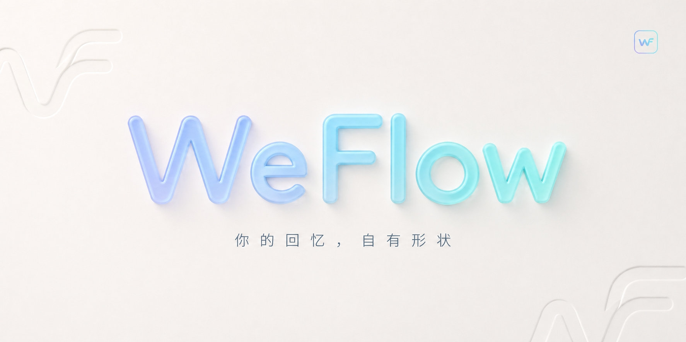

  

<h1 align="center">WeFlow兼容5.0版本</h1>

  WeFlow 是一个<strong>完全本地</strong>的微信<strong>实时</strong>聊天记录查看、分析与导出工具。 
  它可以获取你的微信聊天记录并将其导出，还可以根据你的聊天记录为你生成独一无二的数据与年度报告。

> [!TIP]
> 仅支持微信 **5.0 及以上**版本
>

## 主要功能

- 本地实时查看聊天记录
- 朋友圈图片、视频、**实况**的预览和解密
- 统计分析与群聊画像
- 年度报告与可视化概览
- 导出聊天记录为 HTML 等格式
- HTTP API 接口（面向开发者）
- 查看完整能力清单：[详细功能](#详细功能清单)

## 支持平台与设备

| 平台 | 设备/架构 | 安装包 |
|------|----------|--------|
| Windows | Windows10+、x64 | `.exe` |
| macOS | Apple Silicon（M 系列，arm64） | `.dmg` |
| Linux | x64 设备（amd64） | `.AppImage`、`.tar.gz` |

## 详细功能清单

| 功能模块 | 说明 |
|---------|------|
| **聊天** | 解密聊天中的图片、视频、实况（仅支持谷歌协议拍摄的实况）；支持**修改**、删除**本地**消息；实时刷新最新消息，无需生成解密中间数据库 |
| **消息防撤回** | 防止其他人发送的消息被撤回 |
| **实时弹窗通知** | 新消息到达时提供桌面弹窗提醒，便于及时查看重要会话，提供黑白名单功能 |
| **私聊分析** | 统计好友间消息数量；分析消息类型与发送比例；查看消息时段分布等 |
| **群聊分析** | 查看群成员详细信息；分析群内发言排行、活跃时段和媒体内容 |
| **年度报告** | 生成按年统计的年度报告，或跨年度的长期历史报告 |
| **双人报告** | 选择指定好友，基于双方聊天记录生成专属分析报告 |
| **消息导出** | 将微信聊天记录导出为多种格式：JSON、HTML、TXT、Excel、CSV、PGSQL、ChatLab专属格式等 |
| **朋友圈** | 解密朋友圈图片、视频、实况；导出朋友圈内容；拦截朋友圈的删除与隐藏操作；突破时间访问限制 |
| **联系人** | 导出微信好友、群聊、公众号信息；尝试找回曾经的好友（功能尚不完善） |
| **HTTP API 映射** | 将本地消息能力映射为 HTTP API，便于对接外部系统、自动化脚本与二次开发 |

## HTTP API

WeFlow 提供本地 HTTP API 服务，支持通过接口查询消息数据，可用于与其他工具集成或二次开发。

- **启用方式**：设置 → API 服务 → 启动服务
- **默认端口**：5031
- **访问地址**：`http://127.0.0.1:5031`
- **支持格式**：原始 JSON 或 [ChatLab](https://chatlab.fun/) 标准格式

完整接口文档：[点击查看](docs/HTTP-API.md)

## AI Reply 自动回复扩展

本分支在 WeFlow 5.0.0 底座上重新接入 AI Reply 自动回复能力，侧边栏可进入 **AI 回复** 页面配置模型、触发规则、联系人监听、发送器和回复日志。

使用前请确认已在设置中开启 HTTP API、消息推送并配置 Token；AI Reply 的 SSE 消息来源为本机 `/api/v1/push/messages`，启动前会检查 HTTP API、消息推送、Token、模型、监听规则和发送器健康状态。自动发送能力涉及真实微信窗口操作，请先使用 manual sender 或测试联系人验证，避免误发。

相关文档：

- [AI Reply 发送器说明](docs/ai-reply-senders.md)
- [AI Reply 发送器开发计划](docs/ai-reply-sender-development-plan.md)
- [蒸馏改进计划](docs/distill-improvement-plan.md)
